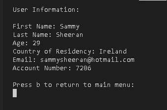

# Banking Simulator Application
This application is a python based banking application. It allows the user to create an account, deposit money, withdraw money, move money to a savings account, buy and sell stocks and/or cryptocurrencies, check account information, check account balances and take a quiz to win a stock share.

## Live Site & Repository
* [Live Site](https://banking-system-simulator-0a3de3c2c22e.herokuapp.com/)
* [Repository](https://github.com/DiarmuidSheeran/bank-system)

## Contents
* [Project Planning](#project-planning)
* [Project Walkthrough](#project-walkthrough)
* [Future Features](#future-features)
* [Technologies Used](#technologies-used)
* [Testing](#testing)
* [Bugs](#bugs)
* [Deployment](#deployment)
* [Credits](#credits)
* [Acknowledgements](#acknowledgements)

## Project Planning

## Project Walkthrough
### Overview
* On startup of the application the user is met with a gretting method and a propmt to begin registering a new account.

* The user is then prompted to enter their first name, last name, age, country of residence and email address.
 
 
 
 

* When all user details are entered correctly they are met with a confirmation message and a random account number is generated for the user.  The user is then prompted to enter an amount to deposit to their account. 

* The user is then navigated to to the main menu. From here the user has access to the different functions of the application. 

* The user can check their account balance  

* The user can make a deposit to their current account balance 
 

* The user can withdraw money from their account after entering their correct account number that was assigned to the on registration.
 
 

* The user can deposit money from their current account to their savings account.
 

* The user can invest in 3 different stocks. The stock prices are generated randomly. 

* The user can invest in 2 different cryptocurrencies. 

* The user can sell their stocks or cryptocurencies and will be told whether they sold at a profit or loss.

* The user's balance is updated as they complete different actions or transactions. The check balance feature also gets updated with their savings and it's interest rate along with fututre projections. The check balance also gets updated with the value of their current investment portfolio.

* The user can check their account information. 

* The user can take a quiz about the stock market with 4 different questions. Upon successful completion of the quiz the user is given a share of google stock. 

 

* The user can log out and quit the application. 

### Fail safes
* When the user tries to enter the wrong character they are prompted to enter they are met with an error

* Regular expression operations are used to make sure only letters are used in the name and country, only number are used in the age and the email must consist of an "@" and "." symbols. 
When the application prompts the user to add a money value regular expresions are called to make sure only a number value is entered. 
If the user enters no value for any of these prompts the will get a "No data entered" error message. 

* If the user enter an age below the age of 18 they will be informed that they cannot create an account under the age of 18

* If the user's balance is to low for the action they are trying to undertake, they will be informed they have an insuffiecient balance to complete the operation. 
An example of this would be that they try to deposit €100 to their savings account but their current account balance is only €50. 

* If the user has no money invested in stocks or crypto and tries to sell their investments they will be given an alert message and a prompt. 

* Because the application only allows the user to own one stock or crypto at a time if the user already owns a share in Google they will recieve the current value of Google deposited into their current account. 

* If the user enters their account number wrong they will be given a security message and prompted to return to the main menu. 
The account number can always be found in user info section. 

* If the user enters a non valid character on the menus the menu function is re-called.

## Future Features
### Due to time constraints on the project there are some features I would have had liked to implement. These include:
* Add an API to get the actual real time value's for the stocks and cryptocurencies.
* I would also like to implement a way for the user to be able to buy more than one stock or cryptocurrency.

## Technolgies Used
### Python
* Used to develop the application
### Github
* Used to store the source code of the application
### Heroku
* Used for deployment and hosting of the application
### Gitpod
* IDE used for creating the application

## Testing
* I have tested that when the program starts the welcome message appears along with prompt to continue.
* I have tested that the forward_key functions works when called upon.
* I have tested that the go_back_key funtction works when called upon.
* I have tested that the user cannot use special characters or numbers in their first name, second name and country.
* I have tested that the user must enter an age over 18.
* I have tested that a user cannot enter a value that is not a number for their age.
* I have tested that a user must enter the symbols "@" and "." for their email.
* I have tested that all money values to be entered throught the application requrire a number with no letters or special characters allowed.
* I have tested that when a user enters a value within the menu option that they are redirected to that menu until a valid character is inputed.
* I have tested that in order to make a withdrawl the user must enter their corrct account number assigned to them upon account registration.
* I have tested that the current account, stock, crypto and savings balance's are all updated correctly when deposits, withdrawls and trasactions are completed. 
* I have tested that the quiz works.
* I have tested that on completion of the quiz that the user either recives a share in google or that value added to their current account.
* I have tested that the clear funtion works to clear the terminal when called.
* I have tested my code using the pep8 checker to validate my python code.

## Bugs
* No bugs in the code have been found to date.

## Deployment
* Navigate to heroku.com & log in.
* Click "new" and create a new App.
* Give the application a name and then choose your region and Click "Create app".
* On the next page click on the Settings tab to adjust the settings.
* Click on the 'config vars' button.
* Supply a KEY of PORT and it's value of 8000. Then click on the "add" button.
* Buildpacks now need to be added.
* These install future dependancies that we need outside of the requirements file.
* Select Python first and then node.js and click save.
* Then go to the deploy section and choose your deployment method.
* To connect with github select github and confirm.
* Search for your repository select it and click connect.
* You can choose to either deploy using automatic deploys which means heroku will rebuild the app everytime you push your changes.
* For this option choose the branch to deploy and click enable automatic deploys.
* This can be changed at a later date to manual.
* Manual deployment deploys the current state of a branch.
* Click deploy branch.

## Credits
### Content
* I used contnet from the course delivered from the [Code Institute](https://codeinstitute.net/ie/) to implent and understand some of the python concepts I had developed.
* I found the [Python Crash Course](https://www.amazon.co.uk/Python-Crash-Course-3Rd-Matthes/dp/1718502702/ref=sr_1_1?keywords=python+crash+course&qid=1688224762&sprefix=python+cra%2Caps%2C54&sr=8-1) book as a great reasurce to further develop and implent python concepts such as loops and lists.
* I used [SDET- QA Automation Techie's](https://www.youtube.com/watch?v=mG3aGgFYJSE&list=PLdK_jsurke3Jv5Z4TE2Z67xreXspgygL8&index=10) Youtube video to help implement the regular expresions in my code.
* I used [Tina Franzen's](https://www.youtube.com/watch?v=x2sWz_S6X94&list=PLdK_jsurke3Jv5Z4TE2Z67xreXspgygL8&index=6) Youtube video to implement the clear screen function.
* I used [johan godinho's](https://www.youtube.com/watch?v=xTh-ln2XhgU&t=737s) Youtube video as a guide to building a bank account application using python.

